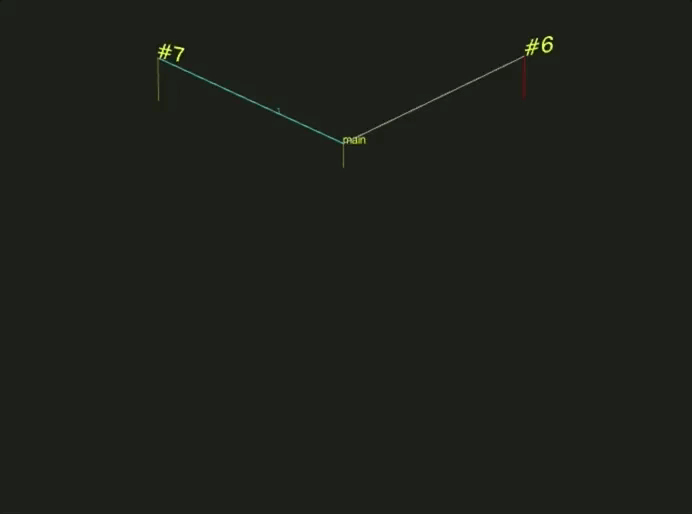

# Go-Concurrency-Visualizer
### Improvements to Ivan Danyliuk's Tool

Above is a visualization of the common fan-in concurrency pattern.\
Note the goroutine towards the bottom left receiving the aggregate merged results from many channels.\
The source code for this program is under `/examples/fanIn/fanIn.go`

# Usage:

Copy a go source file into the root directory of this project, such as `hello.go`.\
Type `./visualize hello.go`

The first time you run this tool, a docker image will be built from source, which may take a few minutes. Subsequent visualizations will be significantly faster.

Press _s_ to slow  the visualization, and _f_ to speed it up. 
Pressing _r_ will restart the visualization.

# About
This tool is built on top of the `gotrace` tool created by Ivan Danyliuk.  The tool developed by Ivan is wonderful.  However, the original `gotrace` suffered from many usability issues, lack of useful error message outpout, and appears to now be unmaintained.

Original tool: https://github.com/divan/gotrace

This wrapper on top of `gotrace` aims to make the tool more accessible to those seeking to visualize concurrency in Go, and is usable out of the box.

# Understanding The Program's Output
Vertical lines represent goroutines.  The length of these lines is a function of time. The more time has gone by, the longer the lines will be.

A _red_ vertical line indicates a goroutine is in a blocked state (waiting on some other goroutine).
A _green_ vertical line indicates a goroutine is unblocked and working.

_Blue_ horizontal lines represent communication across a channel from one goroutine to another.
_Grey_ horizontal lines represent a goroutine spawning, or being terminated.

A ping pong match between two goroutines!

# Future Work
I don't like having to recompile and rerun the program each time, I'll see if I can add some form of caching for unchanged binaries.

